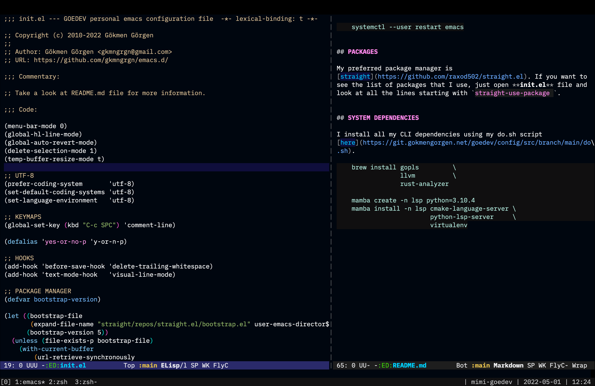

# GOEDEV's EMACS CONFIG

My accessibility-first Emacs configuration.

Please **do not open** a pull-request for this repository. You can
configure your editor from scratch, or give a try for Emacs
distributions like [Spacemacs](https://www.spacemacs.org/), [Doom
Emacs](https://github.com/hlissner/doom-emacs).

## INSTALLATION

Consider installing the minimum version 28.1 of Emacs. Native
compilation is significant in increasing performance. For MacOS:

    brew tap d12frosted/emacs-plus
    brew install emacs-plus --with-native-comp --without-cocoa

Clone the repository to your home folder:

    cd ~
    git clone https://git.goe.dev/goedev/emacs.d.git .emacs.d

Or if you use [dosh](https://github.com/gkmngrgn/dosh/):

    git clone https://git.goe.dev/goedev/emacs.d.git
    cd emacs.d
    dosh install

If you are on Windows, don't forget to add a new environment variable
named "HOME":

    HOME="%USERPROFILE%"

## COPY & PASTE PROBLEM

For Linux and WSL2, install `xsel` and after you select your text,
type `M-|`, then run the command `xsel -bi`.

For MacOS, you can use `pbcopy`.

## EMACS AS A DAEMON

If you want to run Emacs as a Daemon on system startup:

    mkdir -p ~/.config/systemd/user/
    cp ~/.emacs.d/emacs.service ~/.config/systemd/user/emacs.service
    systemctl --user enable --now emacs

To restart it:

    systemctl --user restart emacs

## PACKAGES

My preferred package manager is
[straight](https://github.com/raxod502/straight.el). If you want to
see the list of packages that I use, just open **init.el** file and
look at all the lines starting with `straight-use-package `.

## SYSTEM DEPENDENCIES

I install all my CLI dependencies using my do.sh script [here](https://git.goe.dev/goedev/config/src/branch/main/do.sh).

    brew install gopls               \
                 fd                  \
                 llvm                \
                 lua-language-server \
                 multimarkdown       \
                 ripgrep             \
                 rust-analyzer

    npm i -g typescript                   \
             typescript-language-server   \
             vscode-langservers-extracted \
             yaml-language-server
