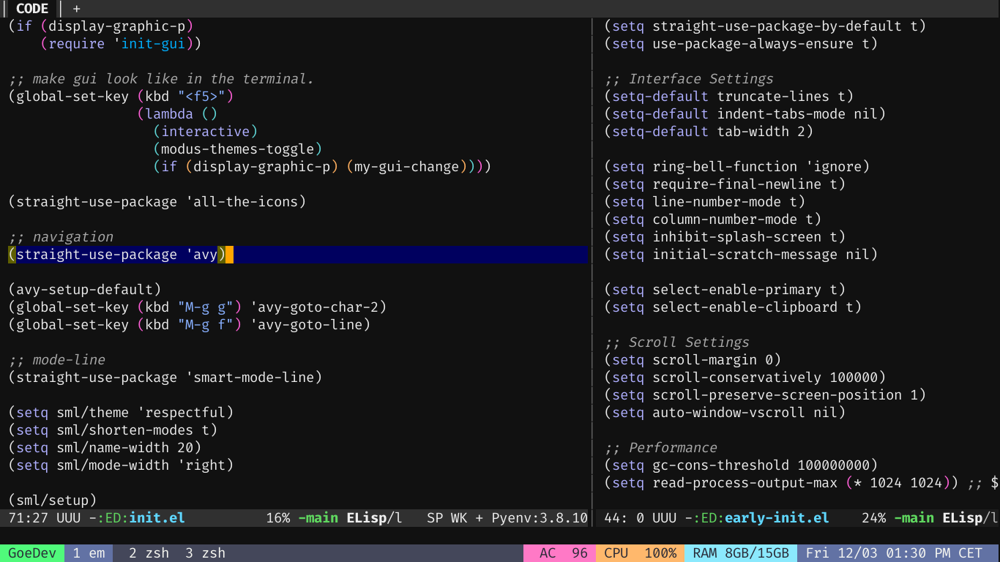

# GKMNGRGN's Emacs Config

My accessibility-friendly Emacs configuration.



Please **do not open** a pull-request for this repository. You can configure your editor from scratch (Don't be afraid of LISP; it's effortless.) or give a try for [Spacemacs][1] or [Doom Emacs][2]. But first, get a new mechanical keyboard.

## My Emacs Build Configuration

```
./autogen.sh
./configure --with-native-compilation
make
make install
```

## Installation

Clone the repository to your home folder:

```
cd ~
git clone https://github.com/gkmngrgn/emacs.d.git .emacs.d
```

If you are on Windows, don't forget to add a new environment variable named "HOME":

```
HOME="%USERPROFILE%"
```

That's all.

## Packages

I use **use-package** to install dependencies. If you want to see the list of packages that I use, just open **init.el** file and look at all the lines starting with `(use-package `.

Some features need to the external dependencies. My current font is **Iosevka**, please get it from [this link][3] or choose another font.

The other external dependency is [ripgrep][4] for searching and filtering. It supports Windows.

## Programming Languages

### C & C++ & CMake

Install **LLVM**, it comes with a language server named [Clangd][5]. Install also [Cmake][6], you will need Python **PIP** to install the language server.

```bash
$ python -m pip cmake-language-server
```

### Common Lisp

[SLIME][7] supports many CL implementations but I prefer to use [SBCL][8]. If your Emacs can't find your SBCL path, specify it [manually][9].

### Dart

Install [Dart SDK][10] or [Flutter][11], it has a builtin analysis tool. Then customize SDK path in your editor. If you don't know how to customize, start with [this tutorial][12].

### Go

Install [Go][13] first, then type this command for LSP support:

```
go get -u golang.org/x/tools/gopls
```

### Rust

Download rust-analyzer [here][14].

[1]: https://www.spacemacs.org/
[2]: https://github.com/hlissner/doom-emacs
[3]: https://typeof.net/Iosevka/
[4]: https://github.com/BurntSushi/ripgrep/
[5]: https://clangd.llvm.org/
[6]: https://cmake.org/download/
[7]: https://common-lisp.net/project/slime/
[8]: http://www.sbcl.org/
[9]: http://ergoemacs.org/emacs/emacs_custom_system.html
[10]: https://dart.dev/
[11]: https://flutter.dev/
[12]: http://ergoemacs.org/emacs/emacs_custom_system.html
[13]: https://go.dev/
[14]: https://github.com/rust-analyzer/rust-analyzer/releases
